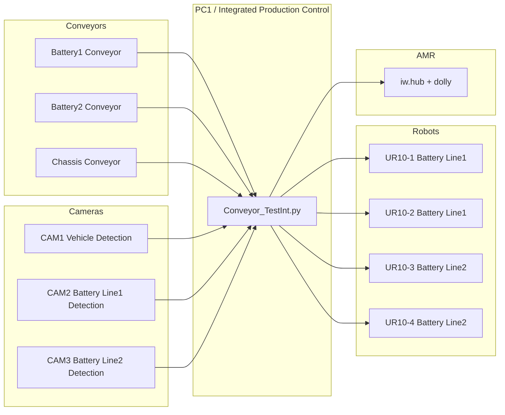
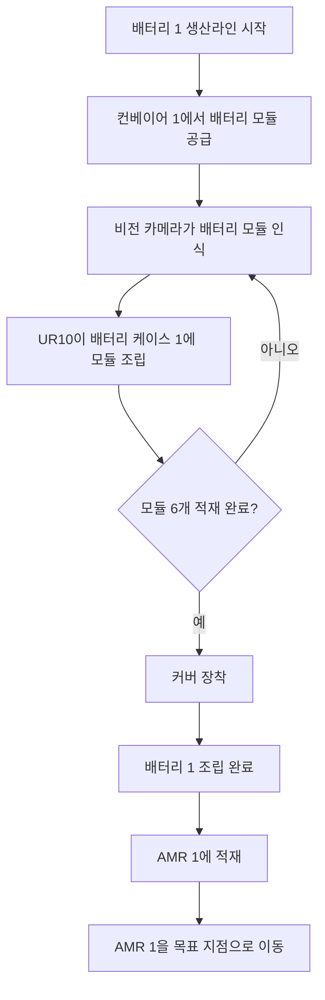
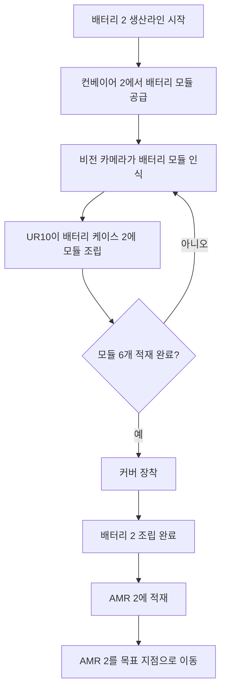
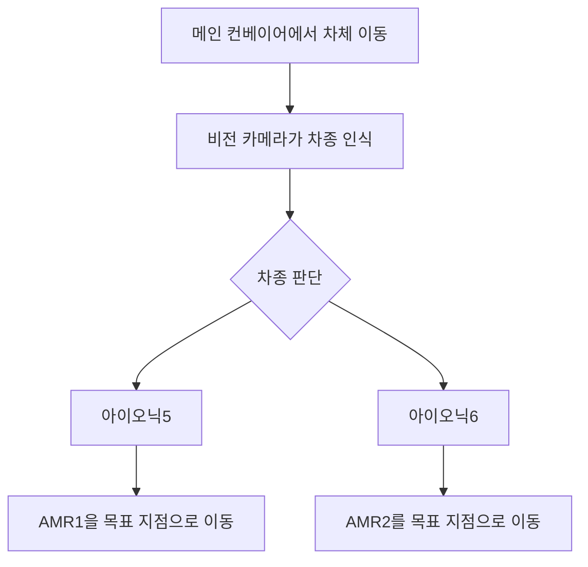
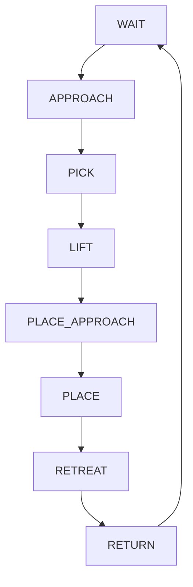

# 프로젝트명
**NVIDIA Isaac Sim 5.0 기반 배터리셀 조립 자동화 공정**

This project was developed using NVIDIA Isaac Sim 5.0 and ROS2 Humble to simulate an automated battery assembly and logistics system.
본 프로젝트는 NVIDIA Isaac Sim 5.0 환경에서 **배터리 모듈 공급, 로봇 조립, 차량 차종 인식, AMR 이송**을 하나의 통합 생산 제어 시스템으로 구현한 시뮬레이션 프로젝트입니다.  
컨베이어 3개 라인, UR10 로봇 4대, 비전 카메라 3대, iw.hub AMR 1대를 활용하여 **배터리 2종 생산라인과 차체 메인 라인을 동시에 제어**합니다.

---

# 주요 기능 (Key Features)

## 1. 배터리 2개 생산라인 동시 제어
- Battery 1 라인과 Battery 2 라인을 독립적으로 동시에 제어
- 각 라인별 컨베이어, 카메라, 로봇 FSM이 분리되어 동작
- 배터리 모듈 공급 → 적재 → 커버 장착 → 완성본 생성까지 자동 수행

## 2. 비전 기반 배터리 모듈 인식
- CAM2: Battery Line 1 모듈 감지
- CAM3: Battery Line 2 모듈 감지
- YOLO 기반 객체 검출을 통해 컨베이어 상의 모듈을 인식
- 감지 트리거 발생 시 컨베이어를 정지하고 PickPoint 기반 픽업 좌표 계산

## 3. UR10 4대 협업 기반 조립 자동화
- UR10-1, UR10-2: Battery Line 1 담당
- UR10-3, UR10-4: Battery Line 2 담당
- 배터리 모듈 적재 로봇과 커버 장착 로봇이 역할을 분담하여 협업 수행

## 4. PickPoint 기반 정밀 피킹
- 각 배터리 모델 내부의 PickPoint Xform을 사용하여 월드 좌표 계산
- TCP 오프셋과 픽업 높이 보정을 통해 정밀한 흡착 픽업 수행

## 5. 완성 배터리 팩 생성 및 재이송
- 모듈이 모두 적재되면 full battery case로 교체
- 커버 장착 후 최종 완성본(battend)으로 교체
- 완성된 배터리 팩을 로봇이 다시 픽업하여 지정 위치로 이송

## 6. 차량 차종 인식 및 AMR 목적지 분기
- CAM1을 사용하여 메인 컨베이어 상 차량을 감지
- ioniq5 / ioniq6 차종에 따라 다른 NAV 명령 실행
- `my_pkg/nav_to_pose2.py`는 ioniq5용, `my_pkg/nav_to_pose.py`는 ioniq6용 목표 위치 담당

## 7. ROS2 Navigation 연동
- `navigation` 패키지의 맵 및 iwhub 관련 파일을 사용
- 양쪽 생산 시나리오가 모두 종료되면 차종에 따라 해당 NAV 명령 자동 실행

---

# 시스템 설계 (System Architecture)

## 전체 시스템 구성

- **Conveyor 3개 라인**
  - Battery 1용 module 공급 conveyor
  - Battery 2용 module 공급 conveyor
  - 차체(ioniq5 / ioniq6)가 지나가는 main conveyor

- **Robot Arm 4대**
  - UR10 + gripper (Battery Line 1 담당) × 2
  - UR10 + gripper (Battery Line 2 담당) × 2

- **AMR 1대**
  - iw.hub + dolly

- **Vision Camera 3대**
  - CAM1: vehicle detection
  - CAM2: battery1 line module detection
  - CAM3: battery2 line module detection

- **PC1**
  - 통합 생산 제어

## Full System Architecture Diagram



`Conveyor_TestInt.py`는 다음 기능을 통합 제어합니다.

- conveyor control
- battery vision detection
- vehicle vision detection
- UR10 control
- iw.hub control

---

# 플로우 차트 (Logic Flow)

## Battery Line 1



## Battery Line 2



## 메인 차량 라인



---

# 로봇 FSM 다이어그램 (Robot FSM)



각 배터리 적재 로봇은 위 상태 머신을 기반으로 동작합니다.  
커버 장착 로봇은 별도의 FSM으로 **어프로치 → 픽업 → 회전 → 오픈 → 완성본 생성** 순으로 동작합니다.

---

# Software Architecture

메인 제어 프로그램

```text
Conveyor_TestInt.py
```

주요 기능

- Conveyor Control
- Vision Detection
- Robot Motion Control
- Vehicle Recognition
- AMR Navigation

---

# 운영체제 환경 (Environment)

| 항목 | 내용 |
|---|---|
| OS | Ubuntu 22.04 |
| Simulator | NVIDIA Isaac Sim 5.0 |
| Language | Python 3.10 |
| Middleware | ROS2 Humble |
| Navigation | Nav2 |

---

# 사용 장비 목록 (Hardware Setup)

| 장비 | 설명 |
|---|---|
| UR10 Robot Arm × 4 | Battery Line1/2 조립 로봇 |
| Surface Gripper | 배터리 모듈 및 커버 흡착 |
| Vision Camera × 3 | 차량/배터리 모듈 인식 |
| Conveyor × 3 | Battery1 / Battery2 / Vehicle 라인 |
| AMR × 1 | iw.hub + dolly |

---

# 의존성 설치 (Installation)

## 1. Python 패키지 설치

```bash
pip install numpy opencv-python torch ultralytics scipy
```

## 2. ROS2 Navigation 설치

```bash
sudo apt update
sudo apt install ros-humble-navigation2
sudo apt install ros-humble-nav2-bringup
```

## 3. ROS2 Workspace 빌드

```bash
cd /home/rokey/IsaacSim-ros_workspaces/humble_ws
colcon build
source install/setup.bash
```

# 폴더 경로 (Installation)
/home/rokey/Documents 안에 assets 폴더 넣기
/home/rokey/isaacsim/exts/isaacsim.examples.interactive/isaacsim/examples/interactive안에 hello_wold 폴더 넣기
/home/rokey/IsaacSim-ros_workspaces/humble_ws안에 src넣기

> 제출 시에는 위 설치 내용과 함께 `requirements.txt` 파일도 zip에 포함하는 것이 가장 안전합니다.

---

# 간단한 실행 순서 (How to Run)

## 1. Isaac Sim 실행
```bash
./isaac-sim.sh
```

## 2. 시뮬레이션 Scene 로드
아이작 심에서
Window - Examples - Robotics Example - ROKEY - ConveyorTestint
load하면 프로젝트 진행

## 3. ROS2 Workspace 준비
```bash
source /opt/ros/humble/setup.bash
source /home/rokey/IsaacSim-ros_workspaces/humble_ws/install/setup.bash
```

## 4. Navigation 실행
`navigation` 패키지 내부 launch/map 설정을 이용하여 Nav2를 실행합니다.

```bash
ros2 launch iw_hub_navigation iw_hub_navigation.launch.py   map:=/home/rokey/IsaacSim-ros_workspaces/humble_ws/src/navigation/iw_hub_navigation/maps/iw_hub_warehouse_navigation.yaml
```


## 6. 전체 동작 순서
1. 배터리 모듈 스폰
2. 양쪽 컨베이어에서 모듈 공급
3. CAM2/CAM3가 모듈 인식
4. UR10 로봇이 케이스에 모듈 적재
5. 6개 적재 완료 시 full case 생성
6. 커버 장착 로봇이 커버 픽업/회전/장착
7. 최종 완성본 생성
8. 완성본 재픽업 및 이송
9. CAM1이 차종 인식
10. 차종에 따라 해당 NAV 명령 실행

---

# 워크스페이스 구조 (Project Structure)
```text
/home/rokey/isaacsim/extension_examples/hello_world
├── Conveyor_TestInt_extension.py
├── ConveyorTestInt.py
├── __init__.py
│   
└── (시뮬레이션 관련 Python/Extension 코드)
```


```text
/home/rokey/IsaacSim-ros_workspaces/humble_ws/src
├── my_pkg
│   ├── nav_to_pose.py
│   └── nav_to_pose2.py
├── navigation
│   ├── map
│   ├── launch
│   └── iwhub 관련 파일
└── (시뮬레이션 관련 Python/Extension 코드)
```

### my_pkg
- `nav_to_pose.py` : ioniq6 목표 위치
- `nav_to_pose2.py` : ioniq5 목표 위치

### navigation
- iwhub 관련 navigation 파일 포함
- map 파일 포함

---

# Git 주소

```text
https://github.com/skyet2870/Rokey6-C3-Isaac-simulation-project
```

---

# Summary

본 프로젝트는 **Vision + Robotics + AMR + Conveyor Control을 통합한 스마트 생산 시스템 시뮬레이션**입니다.

Isaac Sim 환경에서 다음 기술을 통합 구현하였습니다.

- Robot Manipulation
- Vision-based Detection
- Conveyor Automation
- AMR Navigation
- Smart Production Control
